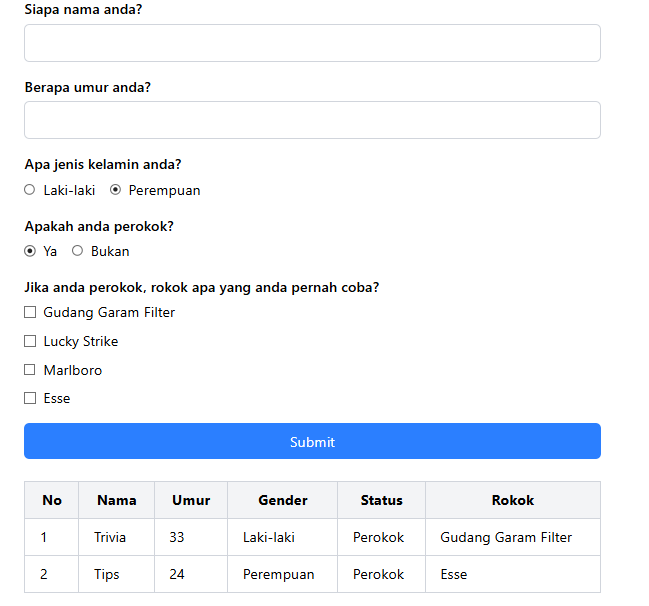

# Smoker Form Survey - ReactJS

This project is a simple React-based web application that allows users to fill out a survey form collecting details such as name, age, gender, smoking status, and cigarette brands (if applicable). The submitted data is displayed in a clean, responsive table below the form, styled with Tailwind CSS for a modern and user-friendly interface.

## Preview



## Getting Started
1. Clone this project:
```
git clone https://github.com/ranandasatria/fgo24-react-table
```

2. Install the depedencies:
```
npm install
```

3. Run the project:
```
npm run dev
```

4. The project will be runnning at:
``` 
http://localhost:8080
```

## Depedencies

This project uses Node.js. Make sure you have Node.js installed on your machine.

- vite: to simulate an HTTP server in a local environment.

## How to contribute

Please open a Pull Request (PR) to contribute to this project.
Your PR will be reviewed and merged if necessary.

## License

This project following MIT License.

## Copyright
&copy; 2025 Kodacademy


